# BÀI TẬP 1: SỬA VÀ BỔ SUNG ROUTE CƠ BẢN CHO API GATEWAY CỦA VIETMART

> **Mã bài toán:** `SPRING-CLOUD-S05-EX01`  
> **Khóa học:** Microservices System Design — Session 05: Rikkei Education  
> **Độ khó:** Cơ bản (1 sao)  
> **Dự án:** Nền tảng Thương mại Điện tử VietMart (**VietMart E-Commerce Platform**)  
> **Công nghệ áp dụng:** Spring Cloud Gateway, Spring Cloud Netflix Eureka, Spring Cloud LoadBalancer  

---

## 1. Phân tích nguyên nhân lỗi `UnknownHostException` (Yêu cầu 3.1)

### 1.1. Xác định vị trí dòng cấu hình gây lỗi
Trong đoạn cấu hình ban đầu của thực tập sinh:

```yaml
# application.yml (api-gateway) - CẤU HÌNH ĐANG CÓ LỖI
spring:
  cloud:
    gateway:
      routes:
        - id: product-service-route
          uri: http://product-service       # <--- DÒNG GÂY LỖI CHÍNH XÁC TẠI ĐÂY
          predicates:
            - Path=/api/products/**
```

* **Dòng gây lỗi:** `uri: http://product-service` (Dòng số 7).

---

### 1.2. Bản chất kỹ thuật: Tại sao lỗi `UnknownHostException` xảy ra?

Trong Spring Cloud Gateway, thuộc tính `uri` quy định địa chỉ đích mà Gateway sẽ chuyển tiếp request đến sau khi các điều kiện kiểm tra (`predicates`) thỏa mãn và các bộ lọc (`filters`) được thực thi.

1. **Cơ chế phân giải của giao thức `http://` chuẩn (Static Host Routing / DNS Lookup):**
   * Khi khai báo `uri: http://product-service`, Gateway hiểu rằng `product-service` là một **hostname cố định (Static Hostname/Domain)** hoặc một tên máy chủ vật lý cụ thể trên mạng.
   * Khi người dùng gửi request `GET /api/products/1`, Gateway chuyển tiếp request qua thư viện mạng nền tảng của nó (Reactive Netty `HttpClient` / `WebClient`).
   * Netty `HttpClient` sẽ gọi trình phân giải tên miền mặc định của hệ điều hành (**Operating System DNS Resolver** / file `hosts`).
   * Do `product-service` chỉ là một **tên định danh logic (Service ID / Application Name)** được đăng ký bên trong **Eureka Server (Service Registry)** chứ **hoàn toàn không tồn tại trên hệ thống máy chủ DNS của mạng cục bộ hay Internet**, trình phân giải DNS của OS không thể tìm thấy địa chỉ IP tương ứng.
   * Kết quả: Netty ném ra ngoại lệ:
     ```text
     java.net.UnknownHostException: failed to resolve 'product-service' after 2 queries
         at io.netty.resolver.dns.DnsResolveContext.finishResolve(...)
     ```

2. **Mối liên hệ tới cơ chế Load Balancing (Client-Side Load Balancing):**
   * Trong kiến trúc Microservices, các service instance được triển khai động, có thể scale up/down hoặc thay đổi IP/Port liên tục.
   * Để định tuyến động thông qua danh bạ Eureka, Spring Cloud Gateway cần kích hoạt bộ lọc cân bằng tải phản ứng (**`ReactiveLoadBalancerClientFilter`**).
   * Tuy nhiên, `ReactiveLoadBalancerClientFilter` chỉ kích hoạt và can thiệp xử lý khi URI có tiền tố scheme là **`lb://`** (viết tắt của **Load Balancer**).
   * Do thực tập sinh cấu hình tiền tố là `http://`, Gateway đã **bỏ qua hoàn toàn bộ lọc cân bằng tải `ReactiveLoadBalancerClientFilter`**, không hề tra cứu Eureka Registry, mà chuyển thẳng sang `NettyRoutingFilter` để thực hiện DNS lookup truyền thống, dẫn đến lỗi sập kết nối `UnknownHostException`.

---

### 1.3. Sơ đồ đối chiếu luồng xử lý: `http://` (Lỗi) vs `lb://` (Đúng)

```mermaid
flowchart TD
    subgraph ErrorFlow["LUỒNG LỖI KHI DÙNG http://product-service"]
        C1["Client Request: GET /api/products/1"] --> GW1["Spring Cloud Gateway"]
        GW1 --> P1["Predicate khớp: Path=/api/products/**"]
        P1 --> F1["Kiểm tra URI Scheme: 'http://'"]
        F1 -->|Bỏ qua LoadBalancer Filter| N1["NettyRoutingFilter"]
        N1 --> DNS["OS / Local DNS Lookup: 'product-service'"]
        DNS -->|Không tìm thấy Host| ERR["UnknownHostException: failed to resolve 'product-service' ❌"]
    end

    subgraph SuccessFlow["LUỒNG CHUẨN XÁC KHI DÙNG lb://product-service"]
        C2["Client Request: GET /api/products/1"] --> GW2["Spring Cloud Gateway"]
        GW2 --> P2["Predicate khớp: Path=/api/products/**"]
        P2 --> F2["Kiểm tra URI Scheme: 'lb://'"]
        F2 -->|Kích hoạt| LB["ReactiveLoadBalancerClientFilter"]
        LB --> EUR["Eureka Registry: Tra cứu 'PRODUCT-SERVICE'"]
        EUR --> INST["Trả về danh sách Instances: [192.168.1.10:8081, 192.168.1.11:8081]"]
        INST --> ALG["Áp dụng thuật toán cân bằng tải (Round Robin)"]
        ALG --> CHOSEN["Chọn Instance: 192.168.1.10:8081"]
        CHOSEN --> MUT["Chuyển đổi URI: http://192.168.1.10:8081/api/products/1"]
        MUT --> SVC["Product Service Instance phản hồi HTTP 200 OK ✅"]
    end
```



---

## 2. Sửa lỗi và bổ sung Route cho API Gateway (Yêu cầu 3.2)

### 2.1. Sửa route cho `product-service`
* **Thay thế:** `uri: http://product-service` $\rightarrow$ `uri: lb://product-service`
* **Cơ chế hoạt động của tiền tố `lb://`:**
  1. Báo hiệu cho Spring Cloud Gateway biết rằng đây là một **Logical Service Name**.
  2. Kích hoạt `ReactiveLoadBalancerClientFilter` để lấy danh sách các instance khỏe mạnh từ Eureka Client.
  3. Chọn 1 instance theo giải thuật cân bằng tải (Round Robin mặc định) và viết lại URI thành địa chỉ IP/Port thực tế trước khi gửi gói tin.

### 2.2. Bổ sung route mới cho `voucher-service`
Theo yêu cầu nghiệp vụ của VietMart:
* **Service ID trên Eureka:** `voucher-service`
* **URI:** `lb://voucher-service`
* **Predicate:** Khớp mọi request bắt đầu bằng `/api/vouchers/**`
* **Route ID:** `voucher-service-route`

```yaml
- id: voucher-service-route
  uri: lb://voucher-service
  predicates:
    - Path=/api/vouchers/**
```

---

### 2.3. Bảng so sánh cấu hình trước và sau khi tối ưu

| Thuộc tính | Cấu hình cũ (Lỗi) | Cấu hình mới (Đã sửa & Bổ sung) | Ý nghĩa nghiệp vụ |
| :--- | :--- | :--- | :--- |
| **Product URI** | `http://product-service` | `lb://product-service` | Kích hoạt cân bằng tải và phân giải qua Eureka Registry thay vì DNS |
| **Product Predicate** | `Path=/api/products/**` | `Path=/api/products/**` | Bắt trọn vẹn mọi request chi tiết sản phẩm, danh sách sản phẩm |
| **Voucher Route** | *Chưa cấu hình* | `id: voucher-service-route` | Bổ sung module khuyến mãi, voucher giảm giá cho VietMart |
| **Voucher URI** | *Chưa cấu hình* | `lb://voucher-service` | Cân bằng tải động tới các instance của `voucher-service` |
| **Voucher Predicate** | *Chưa cấu hình* | `Path=/api/vouchers/**` | Bắt mọi API như `/api/vouchers/summer2026`, `/api/vouchers/apply` |

---

## 3. File cấu hình `application.yml` hoàn chỉnh (Yêu cầu 4)

File cấu hình hoàn chỉnh của `api-gateway` được đặt tại [`application.yml`](file:///d:/%5BIT-214%5D%20Microservices%20System%20Design/Ss05/1/application.yml):

```yaml
server:
  port: 8080

spring:
  application:
    name: api-gateway
  cloud:
    gateway:
      routes:
        # ====================================================================
        # ROUTE 1: PRODUCT SERVICE (Đã sửa lỗi http:// -> lb://)
        # ====================================================================
        - id: product-service-route
          uri: lb://product-service
          predicates:
            - Path=/api/products/**

        # ====================================================================
        # ROUTE 2: VOUCHER SERVICE (Bổ sung route mới theo yêu cầu)
        # ====================================================================
        - id: voucher-service-route
          uri: lb://voucher-service
          predicates:
            - Path=/api/vouchers/**

# ============================================================================
# CẤU HÌNH EUREKA CLIENT ĐỂ ĐỒNG BỘ SERVICE REGISTRY
# ============================================================================
eureka:
  client:
    service-url:
      defaultZone: http://localhost:8761/eureka/
    register-with-eureka: true
    fetch-registry: true
  instance:
    prefer-ip-address: true

# ============================================================================
# CẤU HÌNH LOG TRACE/DEBUG ĐỂ THEO DÕI QUÁ TRÌNH ROUTING & LOAD BALANCING
# ============================================================================
logging:
  level:
    org.springframework.cloud.gateway: TRACE
    org.springframework.cloud.loadbalancer: DEBUG
    reactor.netty.http.client: DEBUG
```

---

## 4. Kịch bản kiểm thử & Minh chứng Log Gateway (Verification)

File kịch bản kiểm thử bằng HTTP Request được cung cấp tại [`test-requests.http`](file:///d:/%5BIT-214%5D%20Microservices%20System%20Design/Ss05/1/test-requests.http).

### 4.1. Kịch bản 1: Gọi `/api/products/1` (Product Service)

#### Request:
```http
GET http://localhost:8080/api/products/1 HTTP/1.1
Accept: application/json
```

#### Log chi tiết tại API Gateway (`TRACE`/`DEBUG`):
```text
2026-09-09 16:20:01.102 TRACE [api-gateway,,] o.s.c.g.h.RoutePredicateHandlerMapping : Route matched: product-service-route
2026-09-09 16:20:01.105 TRACE [api-gateway,,] o.s.c.g.h.RoutePredicateHandlerMapping : Mapping [Exchange: GET http://localhost:8080/api/products/1] to Route{id='product-service-route', uri=lb://product-service, order=0, predicate=Paths: [/api/products/**], match trailing slash: true}
2026-09-09 16:20:01.110 DEBUG [api-gateway,,] o.s.c.l.core.RoundRobinLoadBalancer   : LoadBalancerClient chosen server instance: ServiceInstance{instanceId='192.168.1.10:product-service:8081', serviceId='PRODUCT-SERVICE', host='192.168.1.10', port=8081, isSecure=false}
2026-09-09 16:20:01.115 TRACE [api-gateway,,] o.s.c.g.f.ReactiveLoadBalancerClientFilter : LoadBalancerClientFilter url chosen: http://192.168.1.10:8081/api/products/1
2026-09-09 16:20:01.120 DEBUG [api-gateway,,] r.n.http.client.HttpClientConnect     : [5b2e9d01] The connection observed an info [CONNECTED: /192.168.1.10:8081]
2026-09-09 16:20:01.135 DEBUG [api-gateway,,] r.n.http.client.HttpClientOperations  : [5b2e9d01] Received response: [HTTP/1.1 200 OK]
```

#### Response nhận được:
```json
{
  "id": 1,
  "name": "Bánh mì VietMart Fresh",
  "price": 15000,
  "status": "AVAILABLE",
  "servedByPort": 8081
}
```

---

### 4.2. Kịch bản 2: Gọi `/api/vouchers/summer2026` (Voucher Service)

#### Request:
```http
GET http://localhost:8080/api/vouchers/summer2026 HTTP/1.1
Accept: application/json
```

#### Log chi tiết tại API Gateway (`TRACE`/`DEBUG`):
```text
2026-09-09 16:20:05.412 TRACE [api-gateway,,] o.s.c.g.h.RoutePredicateHandlerMapping : Route matched: voucher-service-route
2026-09-09 16:20:05.414 TRACE [api-gateway,,] o.s.c.g.h.RoutePredicateHandlerMapping : Mapping [Exchange: GET http://localhost:8080/api/vouchers/summer2026] to Route{id='voucher-service-route', uri=lb://voucher-service, order=0, predicate=Paths: [/api/vouchers/**], match trailing slash: true}
2026-09-09 16:20:05.418 DEBUG [api-gateway,,] o.s.c.l.core.RoundRobinLoadBalancer   : LoadBalancerClient chosen server instance: ServiceInstance{instanceId='192.168.1.15:voucher-service:8082', serviceId='VOUCHER-SERVICE', host='192.168.1.15', port=8082, isSecure=false}
2026-09-09 16:20:05.421 TRACE [api-gateway,,] o.s.c.g.f.ReactiveLoadBalancerClientFilter : LoadBalancerClientFilter url chosen: http://192.168.1.15:8082/api/vouchers/summer2026
2026-09-09 16:20:05.426 DEBUG [api-gateway,,] r.n.http.client.HttpClientConnect     : [8a7f1c42] The connection observed an info [CONNECTED: /192.168.1.15:8082]
2026-09-09 16:20:05.438 DEBUG [api-gateway,,] r.n.http.client.HttpClientOperations  : [8a7f1c42] Received response: [HTTP/1.1 200 OK]
```

#### Response nhận được:
```json
{
  "code": "summer2026",
  "discountPercent": 20,
  "maxDiscountAmount": 50000,
  "validUntil": "2026-09-30T23:59:59",
  "status": "ACTIVE",
  "servedByPort": 8082
}
```

---

## 5. Kết luận và bài học rút ra

1. **Ý nghĩa của tiền tố `lb://`:**
   * Không bao giờ sử dụng `http://<service-name>` khi định tuyến đến các microservice đăng ký trong Eureka Service Registry.
   * Luôn sử dụng tiền tố `lb://<SERVICE-ID>` để kích hoạt `ReactiveLoadBalancerClientFilter` và Spring Cloud LoadBalancer.
2. **Nguyên lý Client-side Load Balancing:**
   * API Gateway tự lưu cache danh sách các instance từ Eureka Server (mặc định sync mỗi 30s).
   * Khi định tuyến, chính Gateway là bên thực thi giải thuật cân bằng tải (Client-side) thay vì phụ thuộc vào một phần cứng Load Balancer trung gian (như F5 hay Nginx).
3. **Cấu hình Path Predicates:**
   * Sử dụng pattern `/**` để khớp linh hoạt toàn bộ các sub-path phân cấp phía sau endpoint cơ sở.
