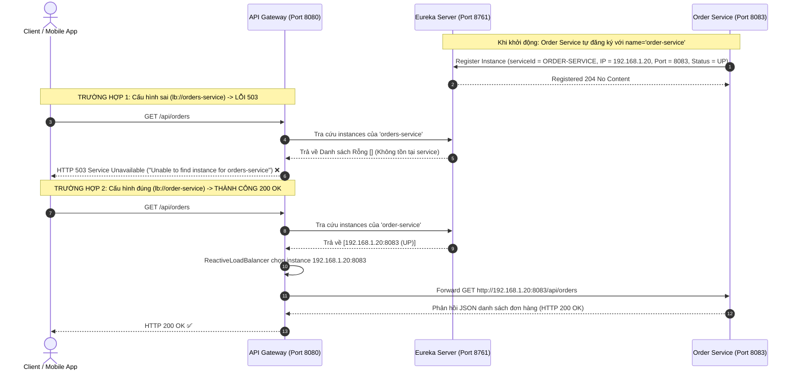

# BÀI TẬP 2: SỬA LỖI SAI TÊN SERVICE-ID TRONG CẤU HÌNH ROUTE

> **Mã bài toán:** `SPRING-CLOUD-S05-EX02`  
> **Khóa học:** Microservices System Design — Session 05: Rikkei Education  
> **Độ khó:** Cơ bản (1 sao)  
> **Dự án:** Nền tảng Thương mại Điện tử VietMart (**VietMart E-Commerce Platform**)  
> **Hiện tượng lỗi:** Gọi `/api/orders` bị trả về `HTTP 503 Service Unavailable`, dù Eureka Dashboard báo instance `UP`.

---

## 1. Phân tích nguyên nhân lỗi (Yêu cầu 3.1)

### 1.1. Điểm không nhất quán giữa hai file cấu hình

Quan sát hai đoạn cấu hình trong hệ thống VietMart:

1. **Trong `application.yml` của `api-gateway`:**
   ```yaml
   spring:
     cloud:
       gateway:
         routes:
           - id: order-service-route
             uri: lb://orders-service       # <--- ĐẶT TÊN LÀ 'orders-service' (DẠNG SỐ NHIỀU, CÓ 's')
             predicates:
               - Path=/api/orders/**
   ```

2. **Trong `application.yml` của `order-service`:**
   ```yaml
   spring:
     application:
       name: order-service                  # <--- ĐẶT TÊN LÀ 'order-service' (DẠNG SỐ ÍT, KHÔNG CÓ 's')
   ```

* **Điểm không nhất quán cốt lõi:**
  * Microservice đơn hàng đăng ký định danh chính thức vào hệ thống với tên: **`order-service`**.
  * Trong khi đó, API Gateway lại cố gắng tìm kiếm và cân bằng tải tới một service có tên là: **`orders-service`**.
  * Sự sai khác một ký tự (`s`) dẫn tới **lỗi lệch khóa tra cứu (Key Mismatch)** giữa Gateway và Eureka Registry.

---

### 1.2. Cơ chế tìm kiếm của LoadBalancerClient & Nguyên nhân lỗi HTTP 503

Nhiều lập trình viên nhầm lẫn rằng *"Trên Eureka Dashboard thấy `order-service` hiển thị xanh (UP) thì chắc chắn Gateway phải gọi được"*. Tuy nhiên, Gateway không tự động đoán tên service, mà tuân thủ một quy trình định danh nghiêm ngặt:

```
[Client Request: /api/orders] 
       │
       ▼
[API Gateway: Khớp Predicate 'Path=/api/orders/**']
       │
       ▼
[Trích xuất URI: 'lb://orders-service'] 
       │
       ▼
[Kích hoạt ReactiveLoadBalancerClientFilter]
       │
       ▼
[Truy vấn Eureka Registry Cache: DiscoveryClient.getInstances("orders-service")]
       │
       ├──> Registry chỉ có 'ORDER-SERVICE' (UP)
       └──> Không có bất kỳ service nào tên 'ORDERS-SERVICE'
       │
       ▼
[Kết quả: Trả về Danh sách Instance RỖNG (Empty List / 0 instances)]
       │
       ▼
[LoadBalancerClient ném ngoại lệ: NotFoundException / 503 SERVICE_UNAVAILABLE]
       │
       ▼
[Gateway phản hồi HTTP 503 Service Unavailable về Client]
```

#### Chi tiết từng bước kỹ thuật:
1. **Đăng ký Service vào Eureka:**
   * Khi `order-service` khởi động, `EurekaClient` đọc thuộc tính `spring.application.name` (`order-service`), chuẩn hóa thành chữ hoa (`ORDER-SERVICE`) và gửi heartbeat đăng ký lên Eureka Server kèm theo thông tin IP:Port và trạng thái `UP`.
2. **Gateway tiếp nhận request & bóc tách Service ID:**
   * Khi client gửi request `GET /api/orders`, Gateway khớp với `order-service-route`.
   * Thấy tiền tố scheme là `lb://`, Gateway chuyển tiếp xử lý cho **`ReactiveLoadBalancerClientFilter`**.
   * Filter trích xuất Hostname trong URI `lb://orders-service` làm `serviceId`: **`orders-service`**.
3. **Tra cứu trong Eureka Discovery Cache:**
   * Spring Cloud LoadBalancer gọi xuống `DiscoveryClient` để lấy danh sách các instance đang hoạt động của `orders-service`.
   * Tuy nhiên, trong bộ nhớ đệm danh bạ Eureka (Eureka Client Local Cache) chỉ tồn tại duy nhất key `ORDER-SERVICE`. Không có key nào là `ORDERS-SERVICE`.
4. **Hậu quả & Mã lỗi HTTP 503:**
   * `DiscoveryClient` trả về một danh sách rỗng (`List<ServiceInstance> = []`).
   * `ReactiveLoadBalancerClientFilter` không thể tìm thấy bất kỳ instance vật lý nào để chuyển tiếp request.
   * Spring Cloud Gateway mặc định xử lý tình huống "không tìm thấy instance nào phục vụ cho Service ID này" bằng cách ném ra ngoại lệ:
     ```text
     org.springframework.cloud.gateway.support.NotFoundException: Unable to find instance for orders-service
     ResponseStatusException: 503 SERVICE_UNAVAILABLE "Unable to find instance for orders-service"
     ```
   * Client lập tức nhận được mã phản hồi **503 Service Unavailable**.

---

### 1.3. Mối quan hệ giữa `uri: lb://...` và `spring.application.name`

| Thành phần | File cấu hình | Bản chất kỹ thuật | Vai trò trong hệ thống |
| :--- | :--- | :--- | :--- |
| **`spring.application.name`** | `order-service` (`application.yml`) | **Khóa định danh gốc (Registered Identifier)** | Đăng ký "khai sinh" tên của microservice lên Service Registry (Eureka/Consul/Nacos). |
| **`uri: lb://<SERVICE-ID>`** | `api-gateway` (`application.yml`) | **Khóa tìm kiếm động (Discovery Lookup Key)** | Ra lệnh cho Gateway: *"Hãy hỏi Eureka xem service có tên `<SERVICE-ID>` đang nằm ở IP/Port nào để forward request tới"*. |

> [!IMPORTANT]
> **Quy tắc vàng trong Microservices System Design:**  
> Chuỗi ký tự đứng sau tiền tố `lb://` trong Gateway bắt buộc phải **khớp chính xác 100%** (không phân biệt chữ hoa/thường, nhưng tuyệt đối không được sai ký tự, số ít/số nhiều, hay dấu gạch nối) với thuộc tính `spring.application.name` của microservice đích.

---

## 2. Cập nhật mã nguồn và sửa lỗi cấu hình (Yêu cầu 3.2)

### 2.1. File `application.yml` hoàn chỉnh của `api-gateway`

Đã cập nhật tại file: [`Ss05/2/application.yml`](file:///d:/%5BIT-214%5D%20Microservices%20System%20Design/Ss05/2/application.yml)

```yaml
server:
  port: 8080

spring:
  application:
    name: api-gateway
  cloud:
    gateway:
      routes:
        # ====================================================================
        # ROUTE: ORDER SERVICE (Đã sửa lỗi orders-service -> order-service)
        # ====================================================================
        - id: order-service-route
          uri: lb://order-service           # SỬA CHÍNH XÁC: Bỏ chữ 's' để khớp với spring.application.name
          predicates:
            - Path=/api/orders/**

# ============================================================================
# CẤU HÌNH EUREKA CLIENT
# ============================================================================
eureka:
  client:
    service-url:
      defaultZone: http://localhost:8761/eureka/
    register-with-eureka: true
    fetch-registry: true
  instance:
    prefer-ip-address: true

# ============================================================================
# CẤU HÌNH LOGGING ĐỂ QUAN SÁT TIẾN TRÌNH LOAD BALANCER
# ============================================================================
logging:
  level:
    org.springframework.cloud.gateway: TRACE
    org.springframework.cloud.loadbalancer: DEBUG
    reactor.netty.http.client: DEBUG
```

---

## 3. Sơ đồ tuần tự xử lý (Sequence Diagram)



---

## 4. Kịch bản kiểm thử & Minh chứng kết quả (Verification)

File kịch bản kiểm thử được lưu tại: [`Ss05/2/test-requests.http`](file:///d:/%5BIT-214%5D%20Microservices%20System%20Design/Ss05/2/test-requests.http).

### 4.1. Thực hiện Request kiểm thử

```http
GET http://localhost:8080/api/orders HTTP/1.1
Accept: application/json
```

### 4.2. Log minh chứng tại API Gateway

* **Trước khi sửa (Lỗi 503):**
  ```text
  TRACE [...] o.s.c.g.h.RoutePredicateHandlerMapping : Route matched: order-service-route
  DEBUG [...] o.s.c.l.core.RoundRobinLoadBalancer   : No servers available for service: orders-service
  WARN  [...] o.s.c.g.f.ReactiveLoadBalancerClientFilter : LoadBalancerClientFilter url chosen: null
  ERROR [...] o.s.c.g.h.FilteringWebHandler         : Response 503 SERVICE_UNAVAILABLE "Unable to find instance for orders-service"
  ```

* **Sau khi sửa (Thành công 200 OK):**
  ```text
  TRACE [...] o.s.c.g.h.RoutePredicateHandlerMapping : Route matched: order-service-route
  TRACE [...] o.s.c.g.h.RoutePredicateHandlerMapping : Mapping [Exchange: GET http://localhost:8080/api/orders] to Route{id='order-service-route', uri=lb://order-service, order=0, predicate=Paths: [/api/orders/**], match trailing slash: true}
  DEBUG [...] o.s.c.l.core.RoundRobinLoadBalancer   : LoadBalancerClient chosen server instance: ServiceInstance{instanceId='192.168.1.20:order-service:8083', serviceId='ORDER-SERVICE', host='192.168.1.20', port=8083, isSecure=false}
  TRACE [...] o.s.c.g.f.ReactiveLoadBalancerClientFilter : LoadBalancerClientFilter url chosen: http://192.168.1.20:8083/api/orders
  DEBUG [...] r.n.http.client.HttpClientConnect     : [3a1c8f92] The connection observed an info [CONNECTED: /192.168.1.20:8083]
  DEBUG [...] r.n.http.client.HttpClientOperations  : [3a1c8f92] Received response: [HTTP/1.1 200 OK]
  ```

### 4.3. Dữ liệu phản hồi trả về cho Client:
```json
[
  {
    "orderId": "ORD-2026-001",
    "customerName": "Nguyen Van A",
    "totalAmount": 350000,
    "status": "CONFIRMED",
    "createdAt": "2026-09-09T10:15:30"
  },
  {
    "orderId": "ORD-2026-002",
    "customerName": "Tran Thi B",
    "totalAmount": 120000,
    "status": "SHIPPING",
    "createdAt": "2026-09-09T14:22:10"
  }
]
```

---

## 5. Danh mục tài liệu bàn giao tại thư mục `Ss05/2`

1. [`application.yml`](file:///d:/%5BIT-214%5D%20Microservices%20System%20Design/Ss05/2/application.yml): File cấu hình API Gateway chuẩn xác, khắc phục triệt để lỗi Service ID.
2. [`README.md`](file:///d:/%5BIT-214%5D%20Microservices%20System%20Design/Ss05/2/README.md): Báo cáo phân tích chuyên sâu về cơ chế định danh và lỗi 503 trong Spring Cloud Gateway.
3. [`test-requests.http`](file:///d:/%5BIT-214%5D%20Microservices%20System%20Design/Ss05/2/test-requests.http): File kịch bản kiểm thử HTTP trực quan.
