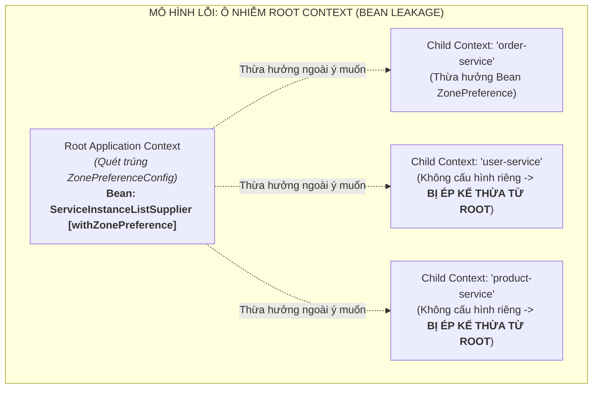
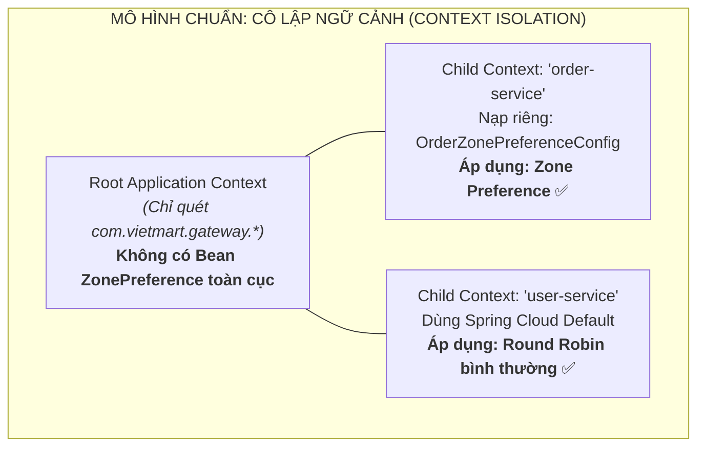

# BÀI TẬP 4: PHÂN TÍCH SỰ CỐ CẤU HÌNH ZONE PREFERENCE VÀ PHẠM VI BEAN TRONG SPRING CLOUD LOADBALANCER

> **Mã bài toán:** `SPRING-CLOUD-S05-EX04`  
> **Khóa học:** Microservices System Design — Session 05: Rikkei Education  
> **Độ khó:** Phân tích (2 sao)  
> **Dự án:** Nền tảng Thương mại Điện tử VietMart (**VietMart E-Commerce Platform**)  
> **Sự cố thực tế:** Sau khi cấu hình Zone Preference cho `order-service`, `user-service` (không liên quan tới Zone Hà Nội) cũng bị dồn toàn bộ lưu lượng vào Zone HCM, bỏ rơi 2 instance tại Hà Nội.

---

## 1. Phân tích nguyên nhân lỗi (Root Cause Analysis - Yêu cầu 3.1)

### 1.1. Cơ chế quét Component của Spring Boot (`@ComponentScan`)

Trong mô hình cấu trúc mã nguồn đang bị lỗi:

```text
com.vietmart.gateway
  ├── ApiGatewayApplication.java        // Đánh dấu @SpringBootApplication
  └── loadbalancer/
        └── ZonePreferenceConfig.java   // Đánh dấu @Configuration (NẰM TRONG VÙNG QUÉT)
```

1. **Phạm vi mặc định của `@SpringBootApplication`:**
   * Annotation `@SpringBootApplication` trên class `ApiGatewayApplication` thực chất là tổ hợp của 3 annotations cốt lõi: `@SpringBootConfiguration`, `@EnableAutoConfiguration` và **`@ComponentScan`**.
   * Mặc định, `@ComponentScan` sẽ quét toàn bộ package chứa lớp khởi chạy (`com.vietmart.gateway`) và **tất cả các sub-packages bên dưới nó** (`com.vietmart.gateway.*`).
2. **Sự cố rò rỉ Bean vào Root Context (Root Application Context Pollution):**
   * Lớp `ZonePreferenceConfig` nằm ở `com.vietmart.gateway.loadbalancer`, lại được đánh dấu bằng `@Configuration`.
   * Khi ứng dụng Spring Boot khởi động, Spring Container quét trúng class này và khởi tạo ngay một Bean kiểu `ServiceInstanceListSupplier` (có tích hợp `.withZonePreference()`) đưa trực tiếp vào **Root Application Context** (ngữ cảnh ứng dụng toàn cục).

---

### 1.2. Kiến trúc phân cấp Context (Hierarchical Context) của Spring Cloud LoadBalancer

Spring Cloud LoadBalancer được thiết kế theo mô hình **Parent - Child Application Context (Ngữ cảnh Cha - Con)**:

* **Root/Parent Context:** Chứa các Bean dùng chung toàn hệ thống (Web server, Gateway filters, Routes, Logging, Security).
* **Child Context (Ngữ cảnh con cho từng Client):** Mỗi service đăng ký (ví dụ: `order-service`, `user-service`, `product-service`) khi được LoadBalancer tạo ra sẽ có một **Spring Application Context con độc lập**.



#### Vì sao `user-service` lại bị dồn tải vào Zone HCM?
1. Khi có request gọi tới `user-service`, Gateway kích hoạt Child Context của `user-service`.
2. Do lập trình viên không khai báo `@LoadBalancerClient(name = "user-service", ...)` riêng, Child Context của `user-service` sẽ tìm kiếm Bean `ServiceInstanceListSupplier` ở ngữ cảnh Cha (Root Context).
3. Tại Root Context, nó tìm thấy ngay Bean do `ZonePreferenceConfig` đăng ký sẵn (có `.withZonePreference()`).
4. Kết quả: **`user-service` bị ép buộc áp dụng chiến lược Zone Preference một cách toàn cục**.
5. Do API Gateway đang đặt ở Zone HCM (`metadata-map.zone=HCM`), LoadBalancer ưu tiên tuyệt đối các instance cùng zone HCM, dẫn đến 2 instance `user-service` ở Zone Hà Nội bị bỏ rơi hoàn toàn.

---

## 2. Đề xuất cải tiến và khắc phục (Yêu cầu 3.2)

### 2.1. Đề xuất cấu trúc Package đúng chuẩn (Context Isolation)

Để ngăn chặn tuyệt đối việc Bean của Child Context bị rò rỉ vào Root Context, cấu hình LoadBalancer cần được đặt **HOÀN TOÀN BÊN NGOÀI** phạm vi quét của `@ComponentScan`, hoặc loại bỏ hoàn toàn `@Configuration`.

```text
com.vietmart.gateway                    <--- VÙNG QUÉT CỦA ROOT CONTEXT (@ComponentScan)
  ├── ApiGatewayApplication.java        <--- Khởi chạy Gateway & gán @LoadBalancerClient
  └── controller / filter / route / ...

com.vietmart.loadbalancer.strategies    <--- NẰM NGOÀI VÙNG QUÉT ROOT CONTEXT (AN TOÀN TUYỆT ĐỐI)
  └── order/
        └── OrderZonePreferenceConfig.java  <--- Chỉ được nạp khi 'order-service' cần
```



---

### 2.2. Mã nguồn triển khai chuẩn mực

#### 1. Lớp cấu hình `OrderZonePreferenceConfig.java`:
Lưu tại: [`com.vietmart.loadbalancer.strategies.order.OrderZonePreferenceConfig`](file:///d:/%5BIT-214%5D%20Microservices%20System%20Design/Ss05/4/src/main/java/com/vietmart/loadbalancer/strategies/order/OrderZonePreferenceConfig.java)

```java
package com.vietmart.loadbalancer.strategies.order;

import org.springframework.cloud.loadbalancer.core.ServiceInstanceListSupplier;
import org.springframework.context.ConfigurableApplicationContext;
import org.springframework.context.annotation.Bean;

/**
 * Cấu hình chỉ nạp vào Child Context của 'order-service'.
 * Không bị Root @ComponentScan quét trúng.
 */
public class OrderZonePreferenceConfig {

    @Bean
    public ServiceInstanceListSupplier discoveryClientServiceInstanceListSupplier(
            ConfigurableApplicationContext context) {
        return ServiceInstanceListSupplier.builder()
                .withDiscoveryClient()
                .withZonePreference()
                .withHealthChecks()
                .build(context);
    }
}
```
*(Không bắt buộc dùng `@Configuration`, nếu dùng thì package ngoài vùng quét đảm bảo an toàn tuyệt đối).*

#### 2. Lớp khởi chạy `ApiGatewayApplication.java`:
Lưu tại: [`com.vietmart.gateway.ApiGatewayApplication`](file:///d:/%5BIT-214%5D%20Microservices%20System%20Design/Ss05/4/src/main/java/com/vietmart/gateway/ApiGatewayApplication.java)

```java
package com.vietmart.gateway;

import com.vietmart.loadbalancer.strategies.order.OrderZonePreferenceConfig;
import org.springframework.boot.SpringApplication;
import org.springframework.boot.autoconfigure.SpringBootApplication;
import org.springframework.cloud.loadbalancer.annotation.LoadBalancerClient;

@SpringBootApplication
@LoadBalancerClient(name = "order-service", configuration = OrderZonePreferenceConfig.class)
public class ApiGatewayApplication {

    public static void main(String[] args) {
        SpringApplication.run(ApiGatewayApplication.class, args);
    }
}
```

---

## 3. Kiến trúc Enterprise: Quản lý 5 Service với 5 chiến lược LoadBalancer khác nhau

Trong môi trường doanh nghiệp thực tế tại VietMart, các service có đặc thù nghiệp vụ và hạ tầng phân bổ khác nhau:
1. **`order-service`:** Chiến lược **Zone Preference** (ưu tiên nội vùng giảm độ trễ thanh toán/đơn).
2. **`product-service`:** Chiến lược **Random LoadBalancer** (xử lý phần cứng máy chủ không đồng nhất).
3. **`payment-service`:** Chiến lược **Same-Instance Preference / Sticky** (xử lý phiên giao dịch ngân hàng).
4. **`inventory-service`:** Chiến lược **Health-Check Active** (kiểm tra định kỳ trạng thái node kho).
5. **`user-service`:** Chiến lược **Round Robin (Mặc định)** (truy vấn profile người dùng phân tán đều).

### 3.1. Sơ đồ tổ chức thư mục mã nguồn (Package Structure)

```text
src/main/java/
├── com.vietmart.gateway/                          <--- VÙNG QUÉT CỦA APPLICATION ROOT CONTEXT
│     ├── ApiGatewayApplication.java               <--- Quản lý @LoadBalancerClients tập trung
│     ├── config/
│     │     └── GatewayRoutesConfig.java           <--- Định tuyến Route Predicates & Filters
│     └── filter/
│           └── AuthenticationHeaderFilter.java
│
└── com.vietmart.loadbalancer.strategies/          <--- VÙNG CHIẾN LƯỢC ĐỘC LẬP (NGOÀI ROOT SCAN)
      ├── order/
      │     └── OrderZonePreferenceConfig.java     <--- Áp dụng cho 'order-service'
      ├── product/
      │     └── ProductRandomConfig.java           <--- Áp dụng cho 'product-service'
      ├── payment/
      │     └── PaymentStickySessionConfig.java    <--- Áp dụng cho 'payment-service'
      └── inventory/
            └── InventoryHealthCheckConfig.java    <--- Áp dụng cho 'inventory-service'
```

---

### 3.2. Cấu hình tập trung tại `ApiGatewayApplication.java`

Sử dụng `@LoadBalancerClients` để khai báo rõ ràng, tập trung toàn bộ ma trận định tuyến cân bằng tải:

```java
package com.vietmart.gateway;

import com.vietmart.loadbalancer.strategies.order.OrderZonePreferenceConfig;
import com.vietmart.loadbalancer.strategies.product.ProductRandomConfig;
import com.vietmart.loadbalancer.strategies.payment.PaymentStickySessionConfig;
import com.vietmart.loadbalancer.strategies.inventory.InventoryHealthCheckConfig;
import org.springframework.boot.SpringApplication;
import org.springframework.boot.autoconfigure.SpringBootApplication;
import org.springframework.cloud.loadbalancer.annotation.LoadBalancerClient;
import org.springframework.cloud.loadbalancer.annotation.LoadBalancerClients;

@SpringBootApplication
@LoadBalancerClients({
    @LoadBalancerClient(name = "order-service", configuration = OrderZonePreferenceConfig.class),
    @LoadBalancerClient(name = "product-service", configuration = ProductRandomConfig.class),
    @LoadBalancerClient(name = "payment-service", configuration = PaymentStickySessionConfig.class),
    @LoadBalancerClient(name = "inventory-service", configuration = InventoryHealthCheckConfig.class)
    // 'user-service' không khai báo ở đây -> Tự động dùng Default RoundRobinLoadBalancer
})
public class ApiGatewayApplication {
    public static void main(String[] args) {
        SpringApplication.run(ApiGatewayApplication.class, args);
    }
}
```

---

### 3.3. Đánh giá lợi ích của mô hình kiến trúc đề xuất

| Tiêu chí | Mô hình cũ (Sai lầm) | Mô hình Enterprise đề xuất |
| :--- | :--- | :--- |
| **Phạm vi Bean (Bean Scope)** | Bị rò rỉ vào Root Context (Bean Leakage) | Độc lập trong từng Child Context (Context Isolation) |
| **Tính độc lập giữa các service** | Lỗi service A gây ảnh hưởng xấu tới service B | Service A thay đổi chiến lược không ảnh hưởng tới service B |
| **Khả năng mở rộng (Scalability)** | Rất khó kiểm soát khi tăng số lượng microservice | Mở rộng dễ dàng: Thêm 1 package chiến lược + 1 dòng khai báo |
| **Tuân thủ nguyên tắc thiết kế** | Vi phạm Single Responsibility Principle (SRP) | Chuẩn Clean Architecture & Separation of Concerns (SoC) |
| **Kiểm thử (Testability)** | Khó viết Integration Test vì Bean xung đột | Dễ dàng Mock và Unit Test từng cấu hình LoadBalancer riêng biệt |

---

## 4. Danh mục tài liệu và mã nguồn bàn giao tại thư mục `Ss05/4`

1. [`OrderZonePreferenceConfig.java`](file:///d:/%5BIT-214%5D%20Microservices%20System%20Design/Ss05/4/src/main/java/com/vietmart/loadbalancer/strategies/order/OrderZonePreferenceConfig.java): Lớp cấu hình Zone Preference chuẩn nằm ngoài vùng quét `@ComponentScan`.
2. [`ProductRandomConfig.java`](file:///d:/%5BIT-214%5D%20Microservices%20System%20Design/Ss05/4/src/main/java/com/vietmart/loadbalancer/strategies/product/ProductRandomConfig.java): Lớp cấu hình Random cho product-service độc lập.
3. [`ApiGatewayApplication.java`](file:///d:/%5BIT-214%5D%20Microservices%20System%20Design/Ss05/4/src/main/java/com/vietmart/gateway/ApiGatewayApplication.java): Main class Gateway tích hợp `@LoadBalancerClients` tập trung.
4. [`application.yml`](file:///d:/%5BIT-214%5D%20Microservices%20System%20Design/Ss05/4/application.yml): File cấu hình định tuyến và zone metadata.
5. [`README.md`](file:///d:/%5BIT-214%5D%20Microservices%20System%20Design/Ss05/4/README.md): Báo cáo kỹ thuật phân tích sự cố Root Cause Analysis chi tiết.
