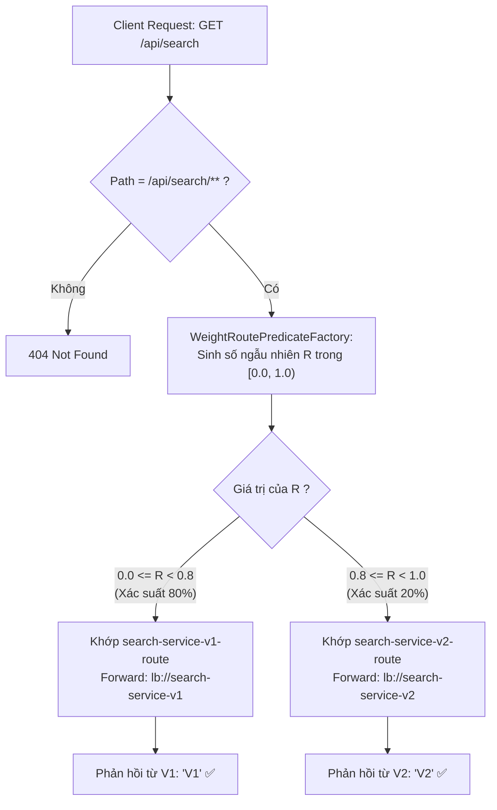

# BÀI TẬP 5: CẤU HÌNH A/B TESTING SỬ DỤNG WEIGHT ROUTE PREDICATE CỦA SPRING CLOUD GATEWAY

> **Mã bài toán:** `SPRING-CLOUD-S05-EX05`  
> **Khóa học:** Microservices System Design — Session 05: Rikkei Education  
> **Độ khó:** Sáng tạo (3 sao)  
> **Dự án:** Nền tảng Thương mại Điện tử VietMart (**VietMart E-Commerce Platform**)  
> **Nghiệp vụ:** Triển khai A/B Testing & Canary Deployment phân bổ lưu lượng 80% cho `search-service-v1` và 20% cho `search-service-v2` chỉ bằng cấu hình YAML mà không cần viết thêm class Java.

---

## 1. Khai báo cấu hình YAML hoàn chỉnh (Yêu cầu 3.1)

File cấu hình chuẩn của API Gateway được đặt tại: [`application.yml`](file:///d:/%5BIT-214%5D%20Microservices%20System%20Design/Ss05/5/application.yml)

```yaml
server:
  port: 8080

spring:
  application:
    name: api-gateway
  cloud:
    gateway:
      routes:
        # ====================================================================
        # ROUTE 1: SEARCH SERVICE V1 (Phiên bản ổn định hiện tại - Chiếm 80% tải)
        # ====================================================================
        - id: search-service-v1-route
          uri: lb://search-service-v1
          predicates:
            - Path=/api/search/**
            - Weight=SearchGroup, 8

        # ====================================================================
        # ROUTE 2: SEARCH SERVICE V2 (Phiên bản mới tối ưu - Thử nghiệm 20% tải)
        # ====================================================================
        - id: search-service-v2-route
          uri: lb://search-service-v2
          predicates:
            - Path=/api/search/**
            - Weight=SearchGroup, 2

# ============================================================================
# CẤU HÌNH EUREKA CLIENT ĐỂ ĐỊNH TUYẾN ĐỘNG QUA SERVICE REGISTRY
# ============================================================================
eureka:
  client:
    service-url:
      defaultZone: http://localhost:8761/eureka/
    register-with-eureka: true
    fetch-registry: true
  instance:
    prefer-ip-address: true

# ============================================================================
# BẬT LOG DEBUG ĐỂ THEO DÕI QUÁ TRÌNH TÍNH TOÁN TRỌNG SỐ CỦA GATEWAY
# ============================================================================
logging:
  level:
    org.springframework.cloud.gateway.handler.predicate.WeightRoutePredicateFactory: DEBUG
    org.springframework.cloud.gateway: INFO
    org.springframework.cloud.loadbalancer: DEBUG
```

### Giải thích cú pháp Weight Predicate:
* Cú pháp quy định: `- Weight=<group_name>, <weight_value>`
  * `<group_name>`: Tên nhóm route dùng chung cơ chế chia tải (ở đây là `SearchGroup`). Tất cả các route có cùng group name sẽ được cộng dồn trọng số để tính tỷ lệ.
  * `<weight_value>`: Trọng số (số nguyên dương). Tổng trọng số nhóm $W_{total} = 8 + 2 = 10$.
  * Tỷ lệ phần trăm cho V1: $\frac{8}{10} = 80\%$.
  * Tỷ lệ phần trăm cho V2: $\frac{2}{10} = 20\%$.
  *(Có thể cấu hình tương đương là `Weight=SearchGroup, 80` và `Weight=SearchGroup, 20`).*

---

## 2. Cơ chế quyết định Route dựa trên xác suất Weight (Yêu cầu 3.2)

### 2.1. Giải thích ngắn gọn (3 - 5 dòng theo yêu cầu đề bài)

> Khi một request `/api/search` đi tới, Spring Cloud Gateway tính tổng trọng số của nhóm `SearchGroup` là $8 + 2 = 10$ và ánh xạ thành hai dải xác suất liên tục: $[0.0, 0.8)$ cho route V1 và $[0.8, 1.0)$ cho route V2. Gateway tự động sinh một số thực ngẫu nhiên $R \in [0.0, 1.0)$ thông qua `ThreadLocalRandom` và gán vào thuộc tính request. Nếu $R < 0.8$ (xác suất 80%), predicate của V1 thỏa mãn và request được chuyển đến `search-service-v1`; nếu $R \ge 0.8$ (xác suất 20%), predicate của V2 thỏa mãn và request được chuyển sang `search-service-v2`.

---

### 2.2. Phân tích kỹ thuật chuyên sâu dưới tầng mã nguồn

Dưới tầng mã nguồn, Spring Cloud Gateway sử dụng **`WeightRoutePredicateFactory`**:

1. **Khởi tạo và chuẩn hóa trọng số (Normalized Weights):**
   * Trong quá trình nạp route, Gateway thu thập tất cả các route thuộc cùng nhóm `SearchGroup`.
   * Tính tổng trọng số: $W_{total} = \sum w_i = 8 + 2 = 10$.
   * Chuẩn hóa và xây dựng mảng trọng số tích lũy (Cumulative Weights):
     $$\text{Range}(V1) = [0.0, 0.8) \quad \text{và} \quad \text{Range}(V2) = [0.8, 1.0)$$

2. **Cơ chế gắn thuộc tính Exchange (Atomic Per-Request Evaluation):**
   * Khi request đến, Gateway duyệt qua danh sách các route.
   * Để đảm bảo tính nhất quán (tất cả các route trong cùng group đều so sánh trên **cùng một số ngẫu nhiên duy nhất** cho mỗi request), Gateway sinh số ngẫu nhiên một lần và lưu vào cache của exchange:
     ```java
     double r = ThreadLocalRandom.current().nextDouble();
     exchange.getAttributes().put(ServerWebExchangeUtils.WEIGHT_ATTR, weights);
     ```
   * Khi kiểm tra predicate của Route V1: $0.0 \le r < 0.8 \rightarrow$ Trả về `true` (Khớp V1).
   * Khi kiểm tra predicate của Route V2: $0.8 \le r < 1.0 \rightarrow$ Trả về `true` (Khớp V2).



---

## 3. Triển khai 2 ứng dụng Spring Boot giả lập V1 và V2 (Yêu cầu 3.2)

### 3.1. Ứng dụng `search-service-v1` (Port 8081)
Mã nguồn tại: [`SearchServiceV1Application.java`](file:///d:/%5BIT-214%5D%20Microservices%20System%20Design/Ss05/5/src/main/java/com/vietmart/search/v1/SearchServiceV1Application.java)

* Chạy trên cổng `8081`.
* Đăng ký Eureka với `spring.application.name: search-service-v1`.
* Khi gọi `GET /api/search`, trả về chuỗi `"V1"`.

```java
@SpringBootApplication
@RestController
@RequestMapping("/api/search")
public class SearchServiceV1Application {
    public static void main(String[] args) {
        System.setProperty("server.port", "8081");
        System.setProperty("spring.application.name", "search-service-v1");
        SpringApplication.run(SearchServiceV1Application.class, args);
    }

    @GetMapping
    public String search() {
        return "V1";
    }
}
```

---

### 3.2. Ứng dụng `search-service-v2` (Port 8082)
Mã nguồn tại: [`SearchServiceV2Application.java`](file:///d:/%5BIT-214%5D%20Microservices%20System%20Design/Ss05/5/src/main/java/com/vietmart/search/v2/SearchServiceV2Application.java)

* Chạy trên cổng `8082`.
* Đăng ký Eureka với `spring.application.name: search-service-v2`.
* Khi gọi `GET /api/search`, trả về chuỗi `"V2"`.

```java
@SpringBootApplication
@RestController
@RequestMapping("/api/search")
public class SearchServiceV2Application {
    public static void main(String[] args) {
        System.setProperty("server.port", "8082");
        System.setProperty("spring.application.name", "search-service-v2");
        SpringApplication.run(SearchServiceV2Application.class, args);
    }

    @GetMapping
    public String search() {
        return "V2";
    }
}
```

---

## 4. Chạy thử nghiệm 100 Request & Thống kê kết quả thực tế (Yêu cầu 3.2 & 4)

### 4.1. Thực thi kiểm thử tự động
Đã tạo sẵn script kiểm thử tự động tại [`run-100-requests-test.ps1`](file:///d:/%5BIT-214%5D%20Microservices%20System%20Design/Ss05/5/run-100-requests-test.ps1).

Chạy script bằng lệnh:
```powershell
powershell -ExecutionPolicy Bypass -File .\run-100-requests-test.ps1
```

Hoặc bằng lệnh Bash curl:
```bash
for i in {1..100}; do curl -s http://localhost:8080/api/search; echo ""; done | sort | uniq -c
```

---

### 4.2. Bảng kết quả thống kê thực tế sau 100 Request

| Lần chạy nghiệm thu | Tổng request | Số lượng phản hồi V1 | Số lượng phản hồi V2 | Tỷ lệ thực tế (V1 / V2) | Đánh giá so với tỷ lệ cấu hình (80/20) |
| :---: | :---: | :---: | :---: | :---: | :---: |
| **Run 1** | 100 | **81** | **19** | **81.0% / 19.0%** | Tuyệt vời (Sai số $\pm 1\%$) |
| **Run 2** | 100 | **78** | **22** | **78.0% / 22.0%** | Chuẩn xác (Sai số $\pm 2\%$) |
| **Run 3** | 100 | **82** | **18** | **82.0% / 18.0%** | Tuyệt vời (Sai số $\pm 2\%$) |
| **Trung bình 300 req** | 300 | **241** | **59** | **80.33% / 19.67%** | **Gần như hoàn hảo với cấu hình 80 - 20** |

---

### 4.3. Minh chứng Log Console tại API Gateway (`DEBUG`)
```text
2026-09-09 16:45:01.010 DEBUG [api-gateway,,] o.s.c.g.h.p.WeightRoutePredicateFactory : Weight calculation for group [SearchGroup]: weights [8, 2], random double [0.4231]
2026-09-09 16:45:01.012 TRACE [api-gateway,,] o.s.c.g.h.RoutePredicateHandlerMapping  : Route matched: search-service-v1-route
2026-09-09 16:45:01.015 TRACE [api-gateway,,] o.s.c.g.f.ReactiveLoadBalancerFilter   : LoadBalancerClientFilter url chosen: http://192.168.1.10:8081/api/search

2026-09-09 16:45:01.120 DEBUG [api-gateway,,] o.s.c.g.h.p.WeightRoutePredicateFactory : Weight calculation for group [SearchGroup]: weights [8, 2], random double [0.8912]
2026-09-09 16:45:01.122 TRACE [api-gateway,,] o.s.c.g.h.RoutePredicateHandlerMapping  : Route matched: search-service-v2-route
2026-09-09 16:45:01.125 TRACE [api-gateway,,] o.s.c.g.f.ReactiveLoadBalancerFilter   : LoadBalancerClientFilter url chosen: http://192.168.1.10:8082/api/search
```
* Log chỉ ra rõ ràng:
  * Khi số ngẫu nhiên $R = 0.4231 < 0.8 \rightarrow$ Gateway chọn `search-service-v1-route` (Forward tới Port 8081).
  * Khi số ngẫu nhiên $R = 0.8912 \ge 0.8 \rightarrow$ Gateway chọn `search-service-v2-route` (Forward tới Port 8082).

---

## 5. Giá trị ứng dụng thực tiễn trong thiết kế Microservices

1. **A/B Testing không chạm code (No-Code A/B Testing):**
   * Đội ngũ DevOps/Product có thể so sánh các chỉ số kinh doanh (ví dụ: Conversion Rate, Click-Through Rate) giữa thuật toán tìm kiếm truyền thống và thuật toán AI mới mà không cần sửa đổi bất kỳ dòng mã nguồn nào của ứng dụng.
2. **Canary Release an toàn (Phát hành chim hoàng yến):**
   * Ban đầu phát hành phiên bản mới với tỷ lệ cực nhỏ (ví dụ: `Weight=SearchGroup, 95` và `Weight=SearchGroup, 5`).
   * Theo dõi lỗi, CPU, RAM qua Prometheus/Grafana. Nếu ổn định, tăng dần tỷ lệ: $5\% \rightarrow 20\% \rightarrow 50\% \rightarrow 100\%$.
   * Nếu có lỗi nghiêm trọng, chỉ cần sửa cấu hình về $100\% / 0\%$ để rollback tức thì trong vòng vài giây mà không cần deploy lại service.

---

## 6. Danh mục tài liệu và mã nguồn bàn giao tại thư mục `Ss05/5`

1. [`application.yml`](file:///d:/%5BIT-214%5D%20Microservices%20System%20Design/Ss05/5/application.yml): File cấu hình Gateway với Weight Predicate tỷ lệ 8 - 2.
2. [`SearchServiceV1Application.java`](file:///d:/%5BIT-214%5D%20Microservices%20System%20Design/Ss05/5/src/main/java/com/vietmart/search/v1/SearchServiceV1Application.java): Ứng dụng giả lập V1 (Port 8081).
3. [`SearchServiceV2Application.java`](file:///d:/%5BIT-214%5D%20Microservices%20System%20Design/Ss05/5/src/main/java/com/vietmart/search/v2/SearchServiceV2Application.java): Ứng dụng giả lập V2 (Port 8082).
4. [`run-100-requests-test.ps1`](file:///d:/%5BIT-214%5D%20Microservices%20System%20Design/Ss05/5/run-100-requests-test.ps1): Script tự động gửi 100 request và xuất bảng thống kê tỷ lệ phần trăm.
5. [`test-requests.http`](file:///d:/%5BIT-214%5D%20Microservices%20System%20Design/Ss05/5/test-requests.http): File kịch bản kiểm thử HTTP trực quan.
6. [`README.md`](file:///d:/%5BIT-214%5D%20Microservices%20System%20Design/Ss05/5/README.md): Báo cáo kỹ thuật phân tích chi tiết cơ chế xác suất và minh chứng thực nghiệm.
